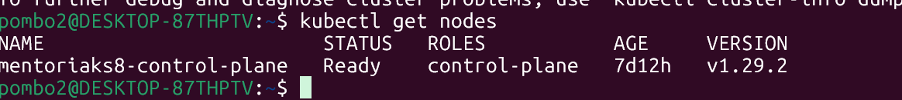
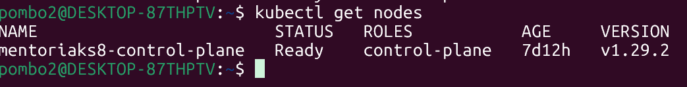
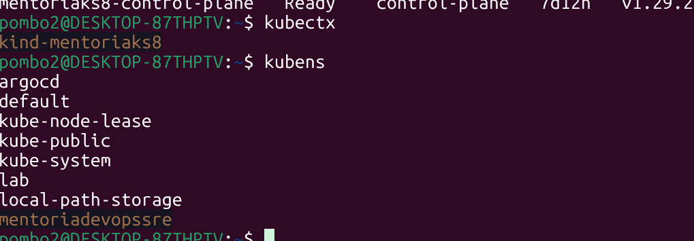

Evidência da instalação do Docker
Evidência do cluster Kubernetes criado e em execução
Evidência do kubectl funcionando
Evidência do kubectx e kubens instalados
Evidência da criação de um namespace (diferente de default)

=============================================================

Evidência da instalação do Docker 

Evidência do cluster Kubernetes criado e em execução 

Evidência do kubectl funcionando 

Evidência do kubectx e kubens instalados 
# Prova o kubectx (mostra o cluster atual)
kubectx

# Prova o kubens (lista os namespaces de forma interativa ou simples)
kubens

