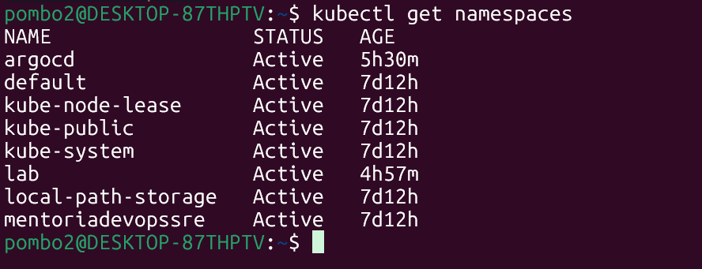

## Evidências do Desafio 2

Abaixo estão as comprovações técnicas das configurações realizadas no ambiente local.

### 1. Instalação do Docker
Confirmação de que o engine do Docker está ativo e operacional no sistema.

---

### 2. Cluster Kubernetes
Status do cluster criado (K3d/Kind) e validação dos componentes do plano de controle.

---

### 3. Ferramentas de Linha de Comando
Validação do funcionamento do kubectl e das ferramentas de produtividade.

**Kubectl Status:**

**Kubectx e Kubens:**
Ferramentas utilizadas para a gestão e alternância rápida entre contextos e namespaces.

---

### 4. Criação de Namespace
Evidência da criação de um namespace dedicado, garantindo o isolamento dos recursos do projeto.
