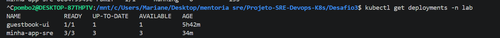
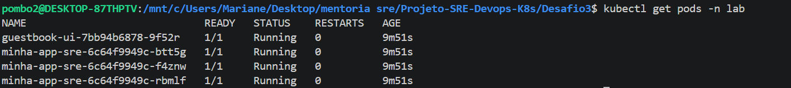
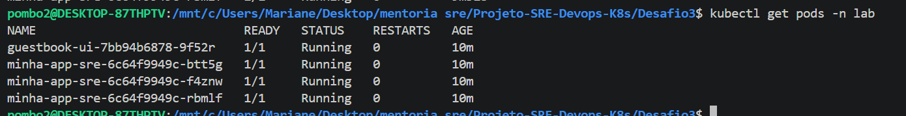
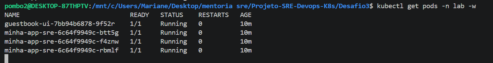

Relatório de Entrega - Desafio 3 (Kubernetes & SRE)
1. Manifestos de Infraestrutura (YAML)
Os arquivos de configuração utilizados para o deploy no cluster podem ser acessados nos links abaixo:

Arquivo YAML do Deployment: deployment.yaml

Arquivo YAML do Service: service.yaml  

2. Registro de Imagem (Docker Hub)
A imagem personalizada para este desafio foi configurada no repositório oficial:

Link da imagem: https://hub.docker.com/r/laiff/projeto-sre-app  

3. Evidências de Operação do Cluster
A. Deployment Criado
Validação da criação do recurso de Deployment no namespace lab.

Comando: kubectl get deployments -n lab

  

B. Pods em Execução
Confirmação de que as instâncias da aplicação estão rodando sem erros.

Comando: kubectl get pods -n lab

  

C. Scaling (Alta Disponibilidade)
Demonstração da escalabilidade horizontal com múltiplas réplicas em execução.

Estratégia: Configurado para 3 réplicas simultâneas.

D. Auto Healing (Resiliência)
Prova de que o cluster recupera automaticamente pods deletados ou com falha.
 
Teste Realizado: Deleção forçada dos pods e monitoramento da recriação imediata.

Comando de monitoramento: kubectl get pods -n lab -w

