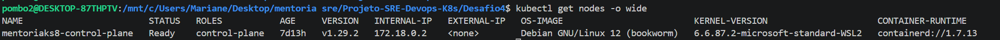
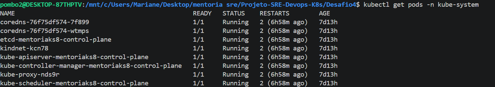
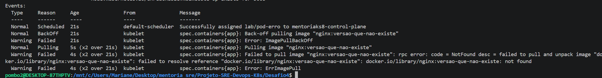

Arquitetura do cluster
Componentes do Control Plane
Componentes dos Nodes
Fluxo do kubectl
Diagnóstico de falhas em Pods

Existe um node chamado mentoriaks9-control-plane  , o runtime usado é CONTAINER-RUNTIME containerd://1.7.13. || SO OS-IMAGE: Debian GNU/Linux 12 (bookworm).
  

    
  kube-apiserver	O "cérebro" e a única porta de entrada. Se alguém invadir isso, controla tudo.
etcd	O banco de dados. Armazena todas as senhas (Secrets) e configurações.
kube-controller-manager	O "vigia". Garante que o número de pods que você pediu seja sempre mantido.
kube-scheduler	O "organizador". Decide em qual servidor físico cada container deve morar.
kube-proxy	O "guarda de trânsito". Cuida das regras de rede e IP para os serviços.
  
Investigação de nodes, usando comando > kubectl describe node mentoriaks8-control-plane <
Name:               mentoriaks8-control-plane
Roles:              control-plane
Labels:             beta.kubernetes.io/arch=amd64
                    beta.kubernetes.io/os=linux
                    kubernetes.io/arch=amd64
                    kubernetes.io/hostname=mentoriaks8-control-plane
                    kubernetes.io/os=linux
                    node-role.kubernetes.io/control-plane=
Annotations:        kubeadm.alpha.kubernetes.io/cri-socket: unix:///run/containerd/containerd.sock
                    node.alpha.kubernetes.io/ttl: 0
                    volumes.kubernetes.io/controller-managed-attach-detach: true
CreationTimestamp:  Thu, 16 Apr 2026 14:02:09 -0300

  
  Atividade 5 & 6: O Cenário de Falha (Troubleshooting)

  
  Criacao de um arquivo yaml com erro , execucao e diagnostico 

    
  